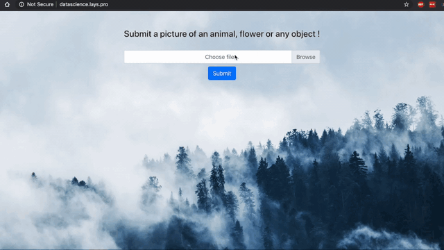

I built a simple inference API originally backed by a CNN ResNet50, but currently InceptionV3 is running. It is available at http://datascience.lays.pro.

## Demo

Note : The gif was sped up at inference time, as the model runs on the free AWS tier with a t2.micro. Real inference time is about 15 seconds for the three images.

## Architecture

Inception-v3 is a convolutional neural network that is trained on more than a million images from the ImageNet database. It can classify images into 1000 object categories, such as keyboard, mouse, pencil, and many animals. As a result, the network has learned rich feature representations for a very wide range of images. The network has an image input size of 299x299. 

Currently, the API is running on a simple t2.micro on AWS EC2 along with my personal website. The back-end code is also on my [github](https://github.com/cyrillay/inference-api-backend).

This project was bootstrapped with [Create React App](https://github.com/facebook/create-react-app).

## Available Scripts

In the project directory, you can run:

### `npm start`

Runs the app in the development mode. 
Open [http://localhost:3000](http://localhost:3000) to view it in the browser.

The page will reload if you make edits. 
You will also see any lint errors in the console.

### `npm test`

Launches the test runner in the interactive watch mode. 
See the section about [running tests](https://facebook.github.io/create-react-app/docs/running-tests) for more information.

### `npm run build`

Builds the app for production to the `build` folder. 
It correctly bundles React in production mode and minimizes, optimizes the build for the best performance.

The app is ready to be deployed ! Just point your webserver to the index.html page of the build folder. 
